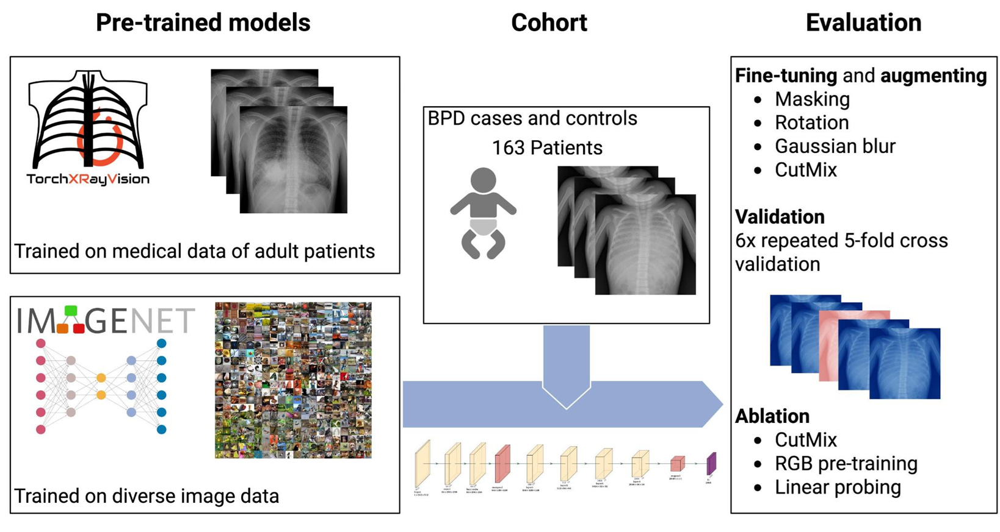

#  BPDneo-CXR

Site-Level Fine-Tuning with Progressive Layer Freezing for Bronchopulmonary Dysplasia Prediction from Day-1 Chest Radiographs in Extremely Preterm Infants.



## Overview

Deep learning approach for early prediction of bronchopulmonary dysplasia (BPD) in extremely low birth weight infants using chest X-rays obtained within 24 hours of birth. Achieves AUROC of 0.78 using domain-specific pretraining with progressive layer freezing on a dataset of 163 patients.

## Key Features

- **Early prediction**: BPD risk assessment from day-1 radiographs
- **Domain-specific pretraining**: TorchXRayVision backbone outperforms ImageNet
- **Small dataset optimization**: Progressive layer freezing prevents overfitting
- **Site-level deployment**: Computationally lightweight for local implementation

## Installation

```bash
conda create --name bpdneo python=3.10
conda activate bpdneo
pip install -r requirements.txt
```

## Usage

### Ablation Study

The main ablation study evaluates different model configurations with various pretraining strategies and training techniques. It implements repeated 5-fold cross-validation to ensure robust performance estimates.

```bash
# Run full ablation study with all experiments
python experiments/ablation_study.py \
    --data-dir /path/to/bpd/data \
    --output-dir ./results

# Run specific experiments
python experiments/ablation_study.py \
    --data-dir /path/to/bpd/data \
    --experiments lpft_progressive_xrv_mixup_lpnomix progressive_freezing_xrv \
    --runs 6 \
    --folds 5

# Custom configuration
python experiments/ablation_study.py \
    --data-dir /path/to/bpd/data \
    --image-dir img \
    --labels-file labels.xlsx \
    --batch-size 16 \
    --num-workers 8 \
    --device cuda
```


#### Available Experiments

The ablation study includes multiple experiment configurations:

**XRV Pretrained Models:**
- `lpft_progressive_xrv_mixup_lpnomix`: Linear probe + progressive freezing with CutMix (best performing)
- `lpft_progressive_xrv`: Linear probe + progressive freezing without augmentation
- `progressive_freezing_xrv`: Progressive freezing only
- `full_finetune_xrv`: Full fine-tuning without freezing

**ImageNet Pretrained Models:**
- `lpft_progressive_rgb`: Linear probe + progressive freezing (RGB)
- `progressive_freezing_rgb`: Progressive freezing only (RGB)
- `full_finetune_rgb`: Full fine-tuning without freezing (RGB)

Results are saved as CSV files with detailed metrics including AUROC, F1 score, sensitivity, and specificity for each fold and run.

## Dataset

The study uses chest radiographs from 163 ELBW infants (≤32 weeks gestation, 401-999g) from the NeoVitaA trial. Images were acquired within 24 hours of birth as part of routine respiratory assessment.

## Results

| Model Configuration | AUROC          | Balanced Accuracy | F1 Score |
|-------------------|----------------|------------------|----------|
| XRV-ProgFreeze + LP + CutMix | 0.783 ± 0.095 | 0.686 ± 0.101 | 0.671 ± 0.111 |
| RGB-ProgFreeze (ImageNet) | 0.717 ± 0.094  | 0.624 ± 0.086 | 0.557 ± 0.123 |

## Pre-trained Models

We provide pre-trained models for BPD prediction, trained on the complete dataset. All models use ResNet-50 architecture with different initialization and training strategies.

### Available Models

Models were trained on the complete dataset and AUROC was computed using repeated 5-fold cross-validation.

| Model | Description | AUROC | Download |
|-------|-------------|-------|----------|
| **bpd_xrv_progfreeze_lp_cutmix** | Best performing model with XRV pretraining, progressive freezing, linear probing, and CutMix | 0.783 | [Download]() |
| **bpd_xrv_progfreeze** | Baseline with XRV pretraining and progressive freezing (no augmentation) | 0.775 | [Download]() |
| **bpd_xrv_fullft** | XRV pretraining with full fine-tuning (no freezing) | 0.761 | [Download]() |
| **bpd_rgb_progfreeze** | ImageNet baseline with progressive freezing (for comparison) | 0.717 | [Download]() |


### Quick Start

```python
from bpd_torch.models.model_util import load_pretrained_model

# Load the best performing model
model = load_pretrained_model("bpd_xrv_progfreeze_lp_cutmix")

# Or download weights only
from bpd_torch.models.model_util import download_model_weights
weights_path = download_model_weights("bpd_xrv_progfreeze_lp_cutmix")
```

## Citation

If you use this code for your work, please cite:

> S. Goedicke-Fritz, M. Bous, A. Engel, M. Flotho, P. Hirsch, H. Wittig, D. Milanovic, D. Mohr, M. Kaspar, S. Nemat, D. Kerner, A. Bücker, A. Keller, S. Meyer, M. Zemlin, P. Flotho, "Site-Level Fine-Tuning with Progressive Layer Freezing: Towards Robust Prediction of Bronchopulmonary Dysplasia from Day-1 Chest Radiographs in Extremely Preterm Infants," arXiv preprint arXiv:2507.12269, 2025.

BibTeX entry:
```bibtex
@article{goedicke2025site,
  title={Site-Level Fine-Tuning with Progressive Layer Freezing: Towards Robust Prediction of Bronchopulmonary Dysplasia from Day-1 Chest Radiographs in Extremely Preterm Infants},
  author={Goedicke-Fritz, Sybelle and Bous, Michelle and Engel, Annika and Flotho, Matthias and Hirsch, Pascal and Wittig, Hannah and Milanovic, Dino and Mohr, Dominik and Kaspar, Mathias and Nemat, Sogand and Kerner, Dorothea and Bücker, Arno and Keller, Andreas and Meyer, Sascha and Zemlin, Michael and Flotho, Philipp},
  journal={arXiv preprint arXiv:2507.12269},
  year={2025}
}
```
